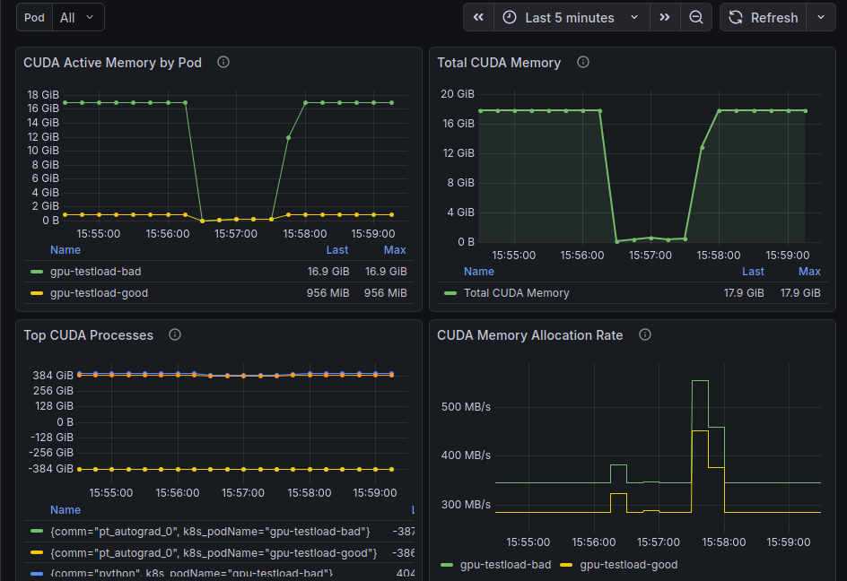
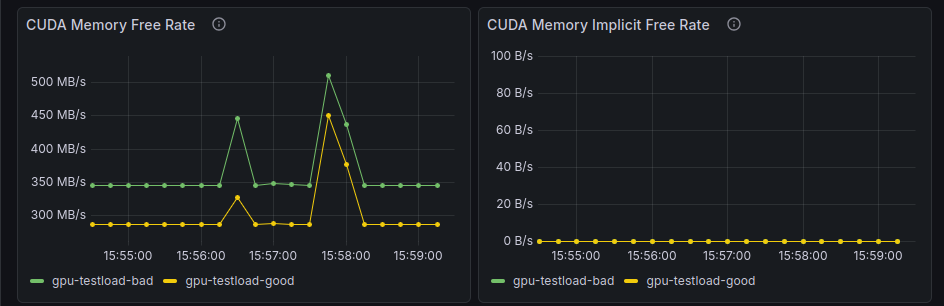
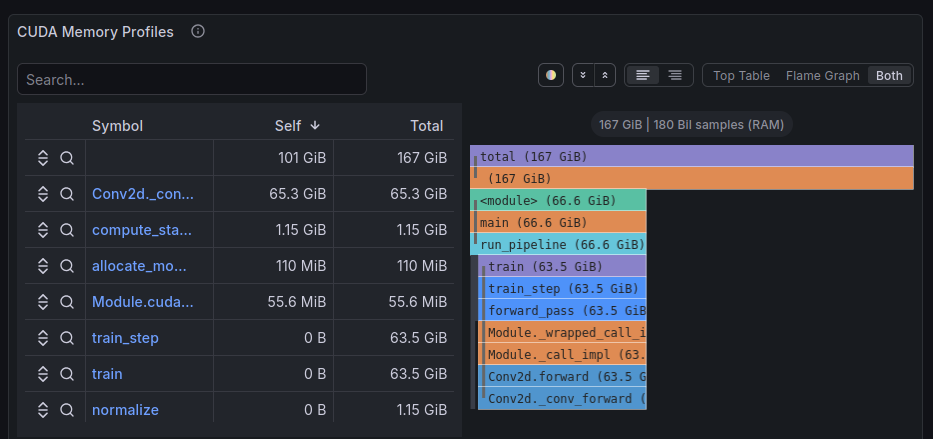

## Advanced GPU Observability with Inspektor Gadget on Kubernetes

This guide contains the instructions to deploy Inspektor Gadget and Pyroscope on
a Kubernetes cluster to profile GPU workloads. The profiles are then visualized
with Grafana.

### Prerequisities

You must have an AKS cluster with at least one GPU node:

```bash
$ kubectl get node -l accelerator=nvidia
NAME                              STATUS   ROLES    AGE    VERSION
aks-nodepool1-29354345-vmss000000 Ready    <none>   4h11m  v1.33.6
```

This [script](https://github.com/eiffel-fl/azure-scripts/blob/f398eb017bf3/az-aks.sh) can help you achieve this.

### Deploying

The following steps are needed to deploy the components:

```bash
$ pushd charts
$ helm repo add inspektor-gadget https://inspektor-gadget.github.io/charts
$ helm repo add grafana https://grafana.github.io/helm-charts
$ helm repo update
$ helm dependency update
$ helm upgrade --install gpu-observability . -n gpu-observability --reset-values --create-namespace -f values-micro-services.yaml -f values.yaml
# Confirm everything is running
$ kubectl get pod -n gpu-observability
NAME                                                         READY   STATUS    RESTARTS   AGE
gadget-h48mv                                                 1/1     Running   0          3m22s
gpu-observability-grafana-547c97b56-xnx6l                    1/1     Running   0          3m21s
gpu-observability-pyroscope-compactor-0                      1/1     Running   0          3m15s
gpu-observability-pyroscope-compactor-1                      1/1     Running   0          3m15s
gpu-observability-pyroscope-compactor-2                      1/1     Running   0          3m15s
gpu-observability-pyroscope-distributor-5b49c774f5-7vqzp     1/1     Running   0          3m19s
gpu-observability-pyroscope-distributor-5b49c774f5-ldhhw     1/1     Running   0          3m19s
gpu-observability-pyroscope-ingester-0                       1/1     Running   0          3m14s
gpu-observability-pyroscope-ingester-1                       1/1     Running   0          3m14s
gpu-observability-pyroscope-ingester-2                       1/1     Running   0          3m14s
gpu-observability-pyroscope-querier-55b58bccfb-whscl         1/1     Running   0          3m18s
gpu-observability-pyroscope-query-frontend-5958779869-tgfzr  1/1     Running   0          3m18s
gpu-observability-pyroscope-query-scheduler-654d8bc555-44jr9 1/1     Running   0          3m17s
gpu-observability-pyroscope-store-gateway-0                  1/1     Running   0          3m13s
gpu-observability-pyroscope-store-gateway-1                  1/1     Running   0          3m13s
gpu-observability-pyroscope-store-gateway-2                  1/1     Running   0          3m13s

$ popd
```

### Testing

The following steps will run a job accessing the GPU, Inspektor Gadget will then
profile the memory operation from the CUDA library and will send the profiles to
pyroscope. The profiles can then be displayed with Grafana.

```bash
$ kubectl apply -f gpu-testload.yaml
```

```
# Use the following to access grafana from http://localhost:3001
$ kubectl -n gpu-observability port-forward svc/gpu-observability-grafana 3001:80
```

You should be able to see our dashboard at: http://localhost:3001/d/gpu-observability/gpu-observability:








Please refer to the [How to Read Flamegraphs](./how-to-read-flamegraphs.md) guide for tips on how to analyze the profiles.
