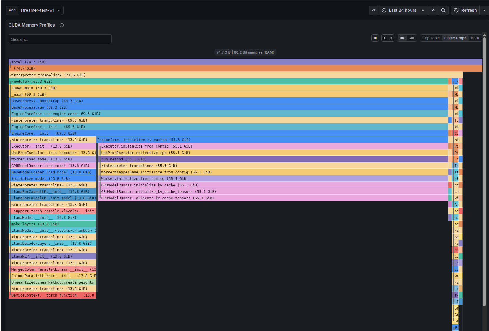
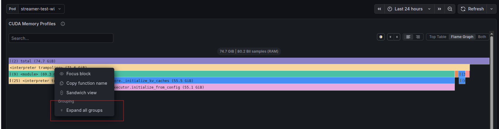
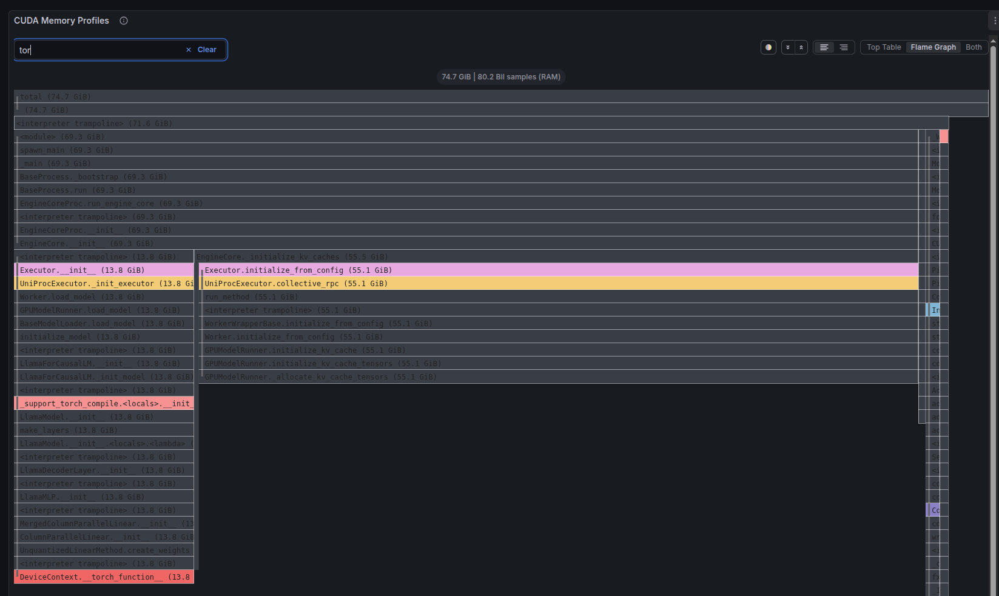
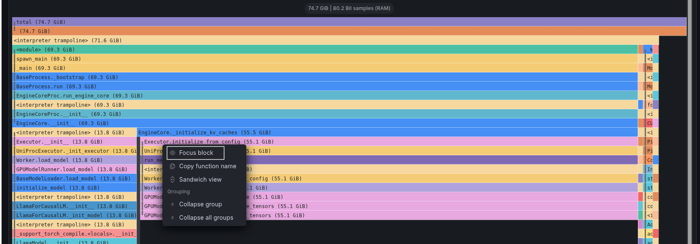
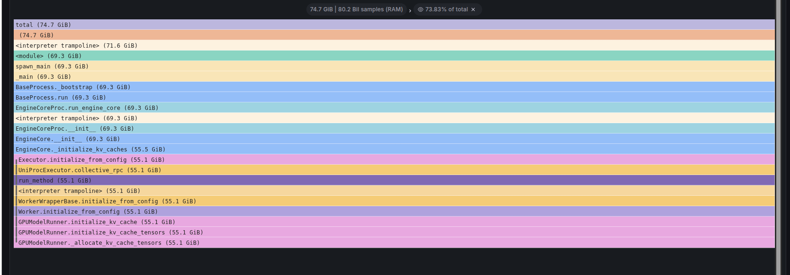
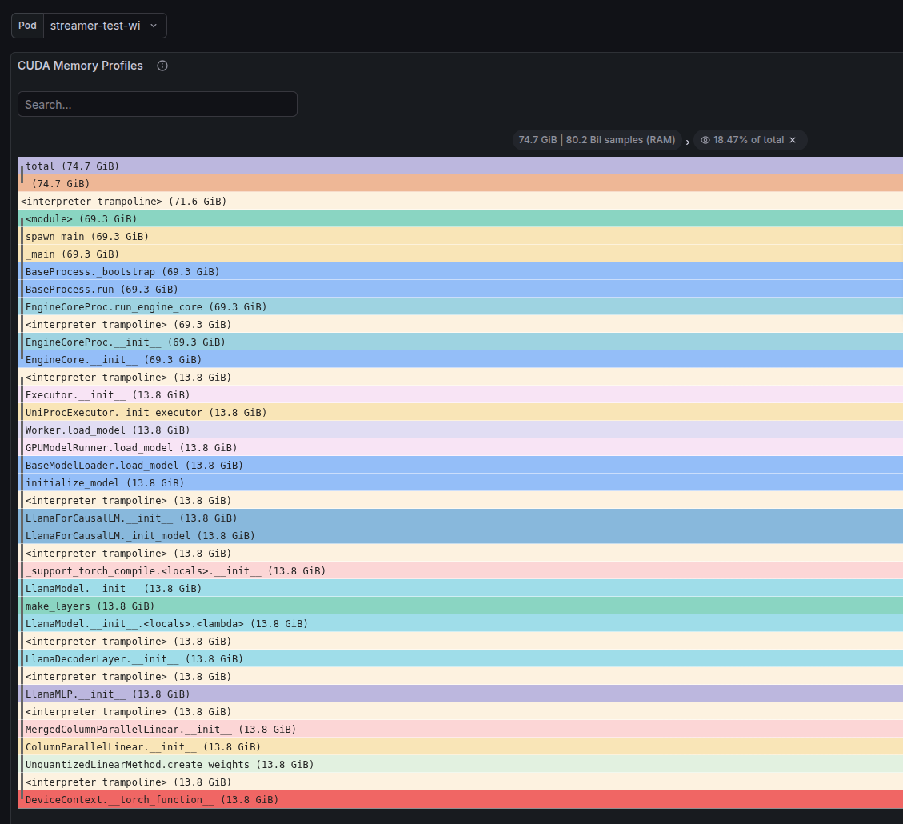
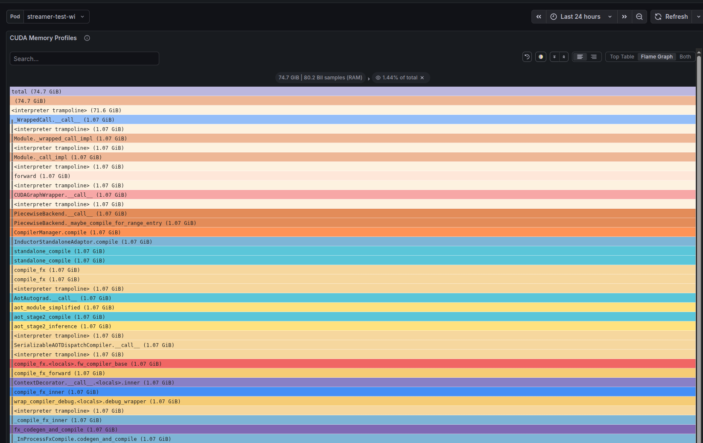
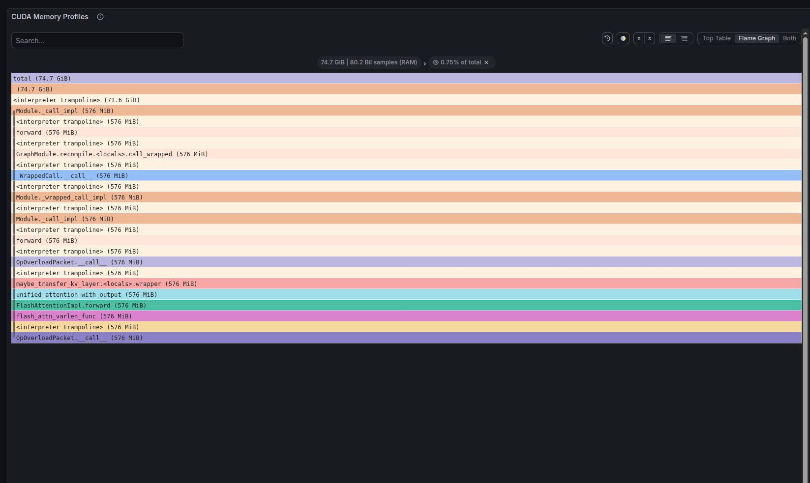

# How to Read Flamegraphs: A Practical Guide

> Using a real GPU memory allocation profile from vLLM as a working example.

---

## What is a Flamegraph?

A flamegraph is a visualization of **profiled call stacks**. Each bar represents a function, and bars are stacked to show the call chain — who called whom. The **width** of each bar represents the resource being measured (CPU time, memory allocated, etc.).



**Key rule:** The width of a bar = how much of the measured resource flows through that function.

> Tip: You can use "Expand all groups" to see the full call stack without collapsing.



> Tip: You can the "Search" box to find specific functions or keywords in the graph.



---

## Reading the Symbols

### Class + Method (most common)

```
GPUModelRunner
_allocate_kv_cache_tensors
```

This maps to:

```python
class GPUModelRunner:
    def _allocate_kv_cache_tensors(self):
        ...
```

Simply: **ClassName → method name**.

### Constructor

```
LlamaMLP
__init__
```

The `__init__` is a **constructor** — called when creating an object (`LlamaMLP(...)`).

`__init__`, `__call__`, `__torch_function__` etc. are called **"dunder" methods** (short for **d**ouble **under**score). Python calls them automatically:

```python
obj = MyClass()      # calls __init__
obj()                # calls __call__
len(obj)             # calls __len__
```

### Standalone Function (no class)

```
_compile_fx_inner
```

A module-level function — not inside any class:

```python
def _compile_fx_inner(...):
    ...
```

### Closures — `<locals>`

```
context_decorator
<locals>
decorate_context
```

The `<locals>` tag means a **nested function** inside another function:

```python
def context_decorator(...):
    def decorate_context(...):   # ← this is what the profiler sees
        ...
    return decorate_context
```

### Lambda — `<lambda>`

```
LlamaModel
__init__
<locals>
<lambda>
```

An **anonymous function** defined inside `__init__`:

```python
class LlamaModel:
    def __init__(self):
        make_layers(
            num_layers,
            lambda prefix: layer_type(prefix=prefix)  # ← this lambda
        )
```

Python can't name it, so the profiler shows `<lambda>` with the enclosing scope chain.

### Special Profiler Symbols

| Symbol | Meaning |
|---|---|
| `<interpreter trampoline>` | CPython's internal dispatch — the bridge between C internals and Python bytecode. Not your code. |
| `<unknown>` | Native C/CUDA code that the profiler can't symbolize (e.g., CUDA driver, libc). |
| `<module>` | Top-level script execution (`if __name__ == "__main__":`). |

### Quick Reference Table

| You see | It means |
|---|---|
| `Foo` → `bar` | `class Foo:` method `def bar()` |
| `Foo` → `__init__` | Constructor of class `Foo` |
| `bar` (alone) | Standalone `def bar()` |
| `Foo` → `bar` → `<locals>` → `baz` | Nested function `baz()` inside `Foo.bar()` |
| `<locals>` → `<lambda>` | Anonymous lambda inside a function |
| `<interpreter trampoline>` | CPython overhead — ignore |
| `<unknown>` | Native C/CUDA code — no Python symbol available |

---

## Self vs Total: The Core Concept

This is the most important thing to understand.

### Total

The **total** of a function = memory (or time) consumed by that function **plus everything it calls**.

Example: `EngineCore.__init__` has a total of 69.3 GB — but it doesn't allocate anything itself. It just calls functions that do.

### Self

The **self** of a function = memory (or time) consumed **directly** by that function, excluding its children.

Example: `GPUModelRunner._allocate_kv_cache_tensors` has 55.1 GB self — it's the function that actually calls `torch.empty()` to create the KV cache tensors.

### Visual



> Tip: We can focus on a specific block using "Focus block"




- **Leaf nodes** (no children above them): their entire width is self.
- **Wide bar with 0 self**: just an orchestrator — safe to ignore when hunting allocations.
- **Wide bar with high self**: this is your target — where the resource is actually consumed.

---

## How to Find the Biggest Resource Consumer

### Step 1: Look at the widest bars at the TOP of the graph

These are the **leaf functions** — where memory is actually being allocated (or CPU time is actually being spent). The wider the bar, the more it consumes.

### Step 2: Check self vs total

A wide bar at the bottom with `self: 0` is just a call chain — not the culprit. Follow it upward until you find the bar with high **self** allocation.

### Step 3: Read the call stack bottom-to-top

The bottom-to-top ordering tells you **why** that function was called:

```
<unknown>                          → native process entry
<interpreter trampoline>           → CPython dispatch
<module>                           → script top-level
EngineCoreProc.run_engine_core     → vLLM engine startup
EngineCore.__init__                → engine initialization
EngineCore._initialize_kv_caches   → KV cache setup
Worker.initialize_from_config      → worker setup
GPUModelRunner.initialize_kv_cache → model runner
GPUModelRunner._allocate_kv_cache_tensors → 💥 actual allocation
```

### Summary

| You want to find... | Look for... |
|---|---|
| What allocates the most | Widest **leaf** bar (top of stack) |
| What's responsible for the most | Widest bar (bottom of stack) |
| Optimization targets | Bars with wide **self** — that's where the resource is consumed |
| Functions to ignore | Wide bars with **0 self** — they just call others |

---

## Real-World Example: vLLM GPU Memory Profile

Here is a memory allocation flamegraph from a vLLM instance serving a Llama model,
profiled with Pyroscope. Total: **~74.7 GB allocated**.

### The 4 allocation paths

#### Path 1: KV Cache — 73.8% (~55.1 GB)


vLLM intentionally grabs **all remaining GPU memory** at startup for KV cache blocks
to maximize inference throughput. This is by design.

#### Path 2: Model Weights — 18.5% (~13.8 GB)



The model is **unquantized** — each layer creates full fp16/bf16 weight tensors.
Quantizing (INT8/INT4) would shrink this significantly.

#### Path 3: Torch Compile — ~1.44% (~1.07 GB)

```
PiecewiseBackend.__call__
  → _maybe_compile_for_range_entry
    → Inductor / Triton autotuning  ← temporary compilation buffers
```

or



JIT compilation and autotuning allocate temporary buffers for benchmarking kernels.

#### Path 4: Inference Runtime — <1%

```
FlashAttentionImpl.forward         ← attention output tensors
Sampler.forward / .sample          ← logits and token sampling
TopKTopPSampler.forward_native     ← top-k/top-p filtering
```

or 



Minimal runtime allocations — most memory is pre-allocated and reused.

---

## Tips for Reading Any Flamegraph

1. **Start from the bottom** — understand the entry point and overall call structure.
2. **Look for wide leaf nodes** — these are your biggest consumers.
3. **Ignore the trampoline** — `<interpreter trampoline>` appears everywhere but is just CPython overhead.
4. **Compare self vs total** — total tells you responsibility; self tells you the actual consumer.
5. **Look for surprises** — functions with unexpectedly large self values may indicate bugs or leaks.
6. **Use filters** — filter by pod, service, or time range to isolate specific workloads.
7. **Compare over time** — run the same profile before and after changes to validate optimizations.
