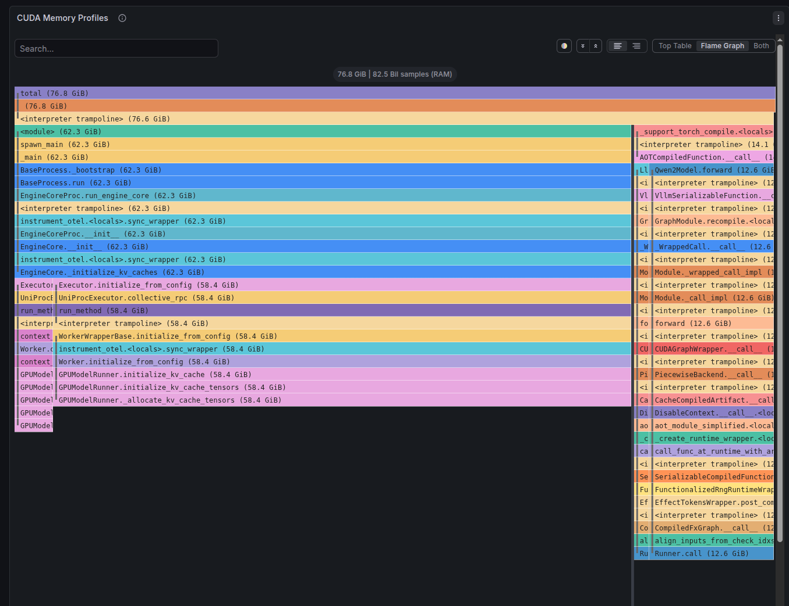
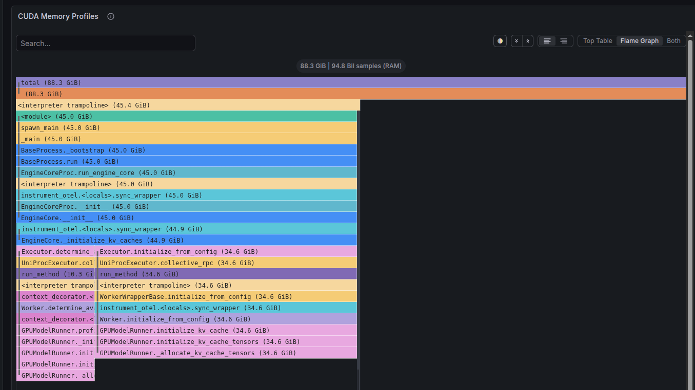
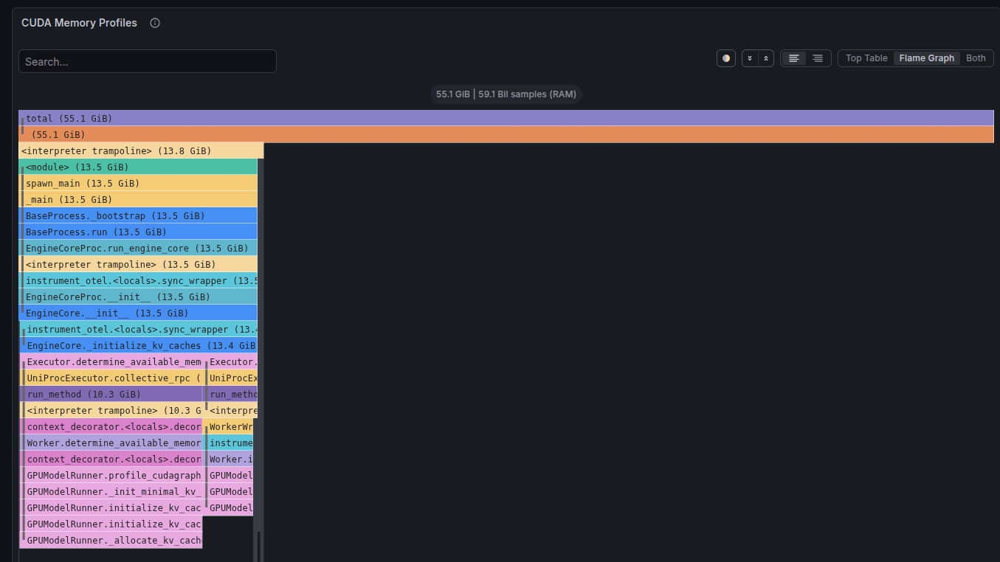
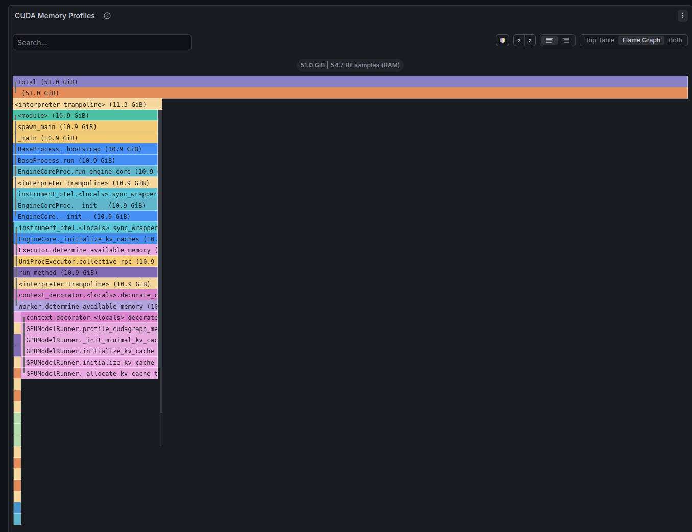

# Debugging vLLM GPU Memory OOM with Flamegraphs

This use case shows how GPU memory allocation flamegraphs can diagnose
out-of-memory (OOM) errors during vLLM model serving — turning hours of
trial-and-error into a 30-second diagnosis.

We use a real vLLM issue
([vllm-project/vllm#38486](https://github.com/vllm-project/vllm/issues/38486))
as the running example.

## The Problem

A user tries to serve **Qwen3.5-35B-A3B-FP8** (an FP8 quantized model) on a
44 GB GPU. vLLM crashes with:

```
torch.OutOfMemoryError: CUDA out of memory. Tried to allocate 1.03 GiB.
GPU 0 has a total capacity of 44.40 GiB of which 858.31 MiB is free.
```

The crash happens at `_allocate_kv_cache_tensors` — vLLM is trying to allocate
KV cache but there's no room left. The user spends 11 comments trying different
combinations of `--gpu-memory-utilization`, `--max-cudagraph-capture-size`, and
`--enforce-eager` before finding a configuration that works.

**With flamegraph profiling, the root cause is visible in a single image.**

## Setup

- **GPU:** NVIDIA A100 80GB PCIe
- **vLLM:** v0.19.0
- **Profiler:** [ig-gpu](https://github.com/inspektor-gadget/ig-gpu-instructions)
  with Pyroscope continuous `malloc` allocation profiler
- **Models tested:**
  - Llama-2-7B (unquantized, bf16) — baseline
  - Qwen3.5-35B-A3B-FP8 (FP8 quantized via Marlin) — the problem model

To simulate the reporter's 44 GB GPU on our 80 GB A100, we lowered
`--gpu-memory-utilization` to restrict the memory budget.

## Understanding the Flamegraph

If you're new to flamegraphs, see our
[How to Read Flamegraphs](../kubernetes/how-to-read-flamegraphs.md) guide.
The key concepts for this use case:

- **Width** of a bar = bytes of GPU memory allocated
- **Self** allocation = memory allocated directly by that function
- **`<unknown>`** = native CUDA allocations (driver, kernels) with no Python
  stack trace — the profiler can't name them
- **`_allocate_kv_cache_tensors`** = vLLM's KV cache allocation

## Profile 1: Unquantized Model (Healthy Baseline)

**Command:**

```bash
vllm serve NousResearch/Llama-2-7b-hf \
    --max-model-len 2048 \
    --gpu-memory-utilization 0.90
```

**vLLM logs:**

```
Model loading took 12.55 GiB memory
Available KV cache memory: 58.37 GiB
GPU KV cache size: 119,536 tokens
Graph capturing finished in 5 secs, took 0.46 GiB
```

**Flamegraph:**

<!-- TODO: Add screenshot of Llama-2-7B flamegraph from Pyroscope -->


**Breakdown:**

| Component | Size | % |
|---|---|---|
| `<unknown>` (CUDA context) | 0.2 GB | 0.24% |
| Model weights (`Runner.call`) | 15.2 GB | 18.4% |
| KV cache (`_allocate_kv_cache_tensors`) | 66.8 GB | 81.0% |
| Compile/autotuning | 0.3 GB | 0.36% |

This is a **healthy profile**. Nearly all memory is visible in named Python
functions. The `<unknown>` is tiny (just CUDA driver context). Model weights
are clearly labeled, KV cache dominates — exactly what you'd expect.

## Profile 2: FP8 Quantized Model (The Problem)

**Command:**

```bash
vllm serve Qwen/Qwen3.5-35B-A3B-FP8 \
    --max-model-len 2048 \
    --gpu-memory-utilization 0.90
```

**vLLM logs:**

```
Model loading took 34.71 GiB memory
Overriding num_gpu_blocks=0 with num_gpu_blocks_override=512
Available KV cache memory: 34.56 GiB
GPU KV cache size: 451,968 tokens
```

**Flamegraph:**

<!-- TODO: Add screenshot of Qwen3.5-35B FP8 flamegraph at 0.90 util from Pyroscope -->


**Breakdown:**

| Component | Size | % |
|---|---|---|
| `<unknown>` (native CUDA) | **46.1 GB** | **48.6%** |
| KV cache (`_allocate_kv_cache_tensors`) | 48.2 GB | 50.8% |
| Model weights (visible in Python) | 0.07 GB | ~0% |
| Compile/profiling | ~0.5 GB | ~0.5% |

The flamegraph immediately reveals the problem: **48.6% of GPU memory sits in
`<unknown>`** — native CUDA allocations with no Python stack trace. Compare
this to just 0.24% for the unquantized model.

Where did the model weights go? FP8 quantization uses **Marlin CUDA kernels**
that allocate memory through native CUDA calls, not through PyTorch. The weights
are there — they're just invisible to Python-level profiling, hidden inside
`<unknown>`.

## Side-by-Side Comparison

<!-- TODO: Add side-by-side screenshot showing both flamegraphs -->


```
Llama-2-7B (unquantized):
  <unknown>:      0.2 GB  ▏                                        0.24%
  Model weights: 15.2 GB  ███████████████                          18.4%  ← visible!
  KV cache:      66.8 GB  ██████████████████████████████████████    81.0%

Qwen3.5-35B FP8 (quantized):
  <unknown>:     46.1 GB  ██████████████████████████████████████    48.6%  ← black hole!
  KV cache:      48.2 GB  ██████████████████████████████████████    50.8%
  Model weights:  0.07 GB ▏                                        ~0%   ← where?!
```

## Profile 3: Simulating a Smaller GPU (Tight Budget)

To reproduce the reporter's scenario (35B FP8 model on a 44 GB GPU), we
lowered `gpu-memory-utilization` to 0.50 (budget: 40 GiB):

**Command:**

```bash
vllm serve Qwen/Qwen3.5-35B-A3B-FP8 \
    --max-model-len 2048 \
    --gpu-memory-utilization 0.50
```

**vLLM logs:**

```
Model loading took 34.71 GiB memory
Overriding num_gpu_blocks=0 with num_gpu_blocks_override=512
Available KV cache memory: 2.87 GiB
GPU KV cache size: 36,960 tokens
```

**Flamegraph:**

<!-- TODO: Add screenshot of Qwen3.5-35B FP8 flamegraph at 0.50 util from Pyroscope -->


**Breakdown:**

| Component | Size | % |
|---|---|---|
| `<unknown>` (native CUDA) | **44.3 GB** | **74.9%** |
| KV cache | 14.2 GB | 23.9% |

The `<unknown>` stays at ~44 GB regardless of the budget — it's a **fixed
cost**. When you lower the utilization, only KV cache shrinks. At 0.50, KV
cache is squeezed down to just 2.87 GiB.

## Profile 4: OOM Crash

At `gpu-memory-utilization=0.45` (budget: 36 GiB), the model can't even start:

**Command:**

```bash
vllm serve Qwen/Qwen3.5-35B-A3B-FP8 \
    --max-model-len 2048 \
    --gpu-memory-utilization 0.45
```

**vLLM logs:**

```
Model loading took 34.71 GiB memory
Overriding num_gpu_blocks=0 with num_gpu_blocks_override=512
Available KV cache memory: -1.1 GiB    ← NEGATIVE!
EngineCore failed to start.
```

**Flamegraph:**

<!-- TODO: Add screenshot of OOM flamegraph from Pyroscope -->


**Breakdown:**

| Component | Size | % |
|---|---|---|
| `<unknown>` (native CUDA) | **35.7 GB** | **99.87%** |
| Model weights (visible) | 0.046 GB | 0.13% |
| KV cache | **0 GB** | **0%** — never allocated |

The flamegraph is a single giant `<unknown>` bar. The process crashed before
KV cache could even be allocated. One look tells you: **the model's fixed cost
exceeds the memory budget.**

## The Complete Picture

All four profiles on the same GPU, same model, different memory budgets:

```
Budget 0.90 (72 GiB) ✅ healthy:
  <unknown>:  46 GB  ████████████████████████                  49%
  KV cache:   48 GB  █████████████████████████                 51%

Budget 0.50 (40 GiB) ✅ tight:
  <unknown>:  44 GB  ██████████████████████████████████████████████████████  75%
  KV cache:   14 GB  █████████████████                                      24%

Budget 0.45 (36 GiB) 💥 OOM:
  <unknown>:  36 GB  ██████████████████████████████████████████████████████████████  99.9%
  KV cache:    0 GB                                                                  0%
```

The flamegraph shows that this model has a **~44 GB fixed cost** in native CUDA
allocations. Any memory budget below that will OOM — no amount of tuning
`--max-cudagraph-capture-size` or `--max-model-len` will help.

## Why FP8 Quantized Models Are Different

For **unquantized models**, weights are allocated through PyTorch's allocator
(`UnquantizedLinearMethod.create_weights` → `DeviceContext.__torch_function__`).
They appear as named functions in the flamegraph — fully visible and trackable.

For **FP8 quantized models**, weights are loaded through **Marlin CUDA kernels**
(`MarlinFP8ScaledMMLinearKernel`) that allocate memory through native CUDA calls.
These bypass PyTorch's memory tracking entirely, showing up as `<unknown>` in
the flamegraph.

This matters because vLLM's memory profiler uses both PyTorch stats and CUDA
`mem_get_info()` to budget memory. When most of the memory is in native
allocations, the profiler's calculations become less reliable — as shown by
`num_gpu_blocks=0` being overridden in every FP8 run.

## Key Takeaway

| Without profiling | With profiling |
|---|---|
| 11 comments of trial-and-error | One flamegraph |
| "Try 0.9... OOM. Try 0.85... OOM. Try --enforce-eager... works but slow" | "Fixed cost is 44 GB — this model needs a bigger GPU" |
| Hours of debugging | 30 seconds |

GPU memory allocation flamegraphs turn vLLM memory debugging from guesswork
into data-driven diagnosis. They show **where every byte goes** — including
native CUDA allocations that don't appear in Python logs.

## Related Issues

- [vllm-project/vllm#38486](https://github.com/vllm-project/vllm/issues/38486) —
  CUDA graph takes too much memory for Qwen 3.5 (the issue we reproduced)
- [vllm-project/vllm#27951](https://github.com/vllm-project/vllm/issues/27951) —
  RFC: Fixing the inaccurate memory profiling (the underlying design issue)
- [vllm-project/vllm#36973](https://github.com/vllm-project/vllm/issues/36973) —
  Kernel warmup leaks GPU memory (related TMA/Triton issue)
